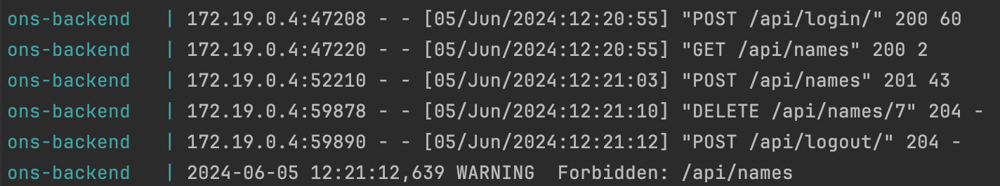

# ons

Online Name Server

## Setup

1. GitHub-Projekt clonen:

`git clone git@github.com:noebuerki/ons.git`

2. App lokal starten

`docker compose -f docker-compose.local.yml up`

## Softwarearchitektur

### Libraries

Wir verwenden in unserem Projekt diverse Libraries im Frontend und Backend, damit wir nicht alles selber machen müssen.

#### Frontend

Folgende Packages wurden mit npm für das JavaScript-Frontend installiert:

| Package                  | Version | Beschreibung                                                                                                               |
| ------------------------ | ------- | -------------------------------------------------------------------------------------------------------------------------- |
| svelte                   | 4.2.7   | Das genutzte Komponenten-Framework.                                                                                        |
| @sveltejs/kit            | 2.0.0   | Das Meta-Framework für svelte, welches die Applikation mit Routing erweitert.                                              |
| @sveltejs/adapter-static | 3.0.1   | Der Adapter der dafür sorgt, dass von vite statisches HTML/CSS/JS gebildet wird. Und bietet somit eine Alternative zu SSR. |
| vite                     | 5.0.3   | Buildet die Applikation zu einem Bundle für den Browser                                                                    |
| axios                    | 1.6.8   | Vereinfacht einheitliche Requests an das Backend. Setzt beispielsweise den CSRF in den Header.                             |
| flowbite                 | 2.3.0   | Eine Javascript-UI-Komponentenbibliothek.                                                                                  |
| flowbite-svelte          | 0.46.1  | Eine Library für die direkte Integration von flowbite zu svelte-Komponenten.                                               |
| tailwindcss              | 3.3.6   | Ein umfangreiches CSS-Framework, welches von flowbite verwendet wird.                                                      |
| typescript               | 5.0.0   | Erweitert JavaScript mit Typen.                                                                                            |

#### Backend

Folgende Packages wurden mit pip für das Python-Backend installiert:

| Package                   | Version | Beschreibung                                                                                        |
| ------------------------- | ------- | --------------------------------------------------------------------------------------------------- |
| daphne                    | 3.0.2   | HTTP-Protokollserver für asgi, um die Django-App laufen zu lassen                                   |
| django                    | 4.2.11  | Webframework mit MVP-Schema                                                                         |
| django-cors-headers       | 4.3.1   | Unterstützt die Handhabung der CORS-Headers, damit das Frontend requests an das Backend machen kann |
| django-extensions         | 3.1.5   | Sammlung von Django-Erweiterungen, unter anderem Commands und im Adminbereich                       |
| django-rest-passwordreset | 1.4.1   | Generierung von Tokens für das Zurücksetzten von Passwörtern                                        |
| djangorestframework       | 3.14.0  | Ermöglicht Django als REST API zu verwenden                                                         |
| drf-nested-routers        | 0.93.5  | Fügt den Support von verschachtelten Routers hinzu                                                  |
| isort                     | 5.13.2  | Linting-Tool für Python Imports                                                                     |
| psycopg2-binary           | 2.9.9   | PostgreSQL Datenbankadapter für Django                                                              |
| pytest                    | 8.1.0   | Testframework für automatische Softwaretests                                                        |
| ruff                      | 0.3.0   | Linting-Tool für Python-Code                                                                        |
 
### Logging

Django bietet bereits ein umfangreiches Logging, welches alle nützlichen Informationen liefert um Fehler zu debuggen.



Das Logging kann jederzeit ergänzt werden:

```python
import logging

import logging
logger = logging.getLogger(__name__)
logging.basicConfig(filename='example.log', encoding='utf-8', level=logging.DEBUG)
logger.debug('This message should go to the log file')
logger.info('So should this')
logger.warning('And this, too')
logger.error('And non-ASCII stuff, too, like Øresund and Malmö')
```

Codeausschnitt von [docs.python.org](https://docs.python.org/3/howto/logging.html#logging-to-a-file)

## UI-Design

Im Design wurde auf die [flowbite](https://flowbite.com/)-Library gesetzt. Im Farbschema haben wir uns für eine eigene Palette entschieden. Dazu haben wir die tailwind.config.cjs-Datei mit folgendem erweitert:
```javascript
{
    primary: {
        50: '#F8F2FF',
        100: '#F4EEFF',
        200: '#E6DEFF',
        300: '#D7CCFF',
        400: '#C3ADFF',
        500: '#7D5CFF',
        600: '#572FFF',
        700: '#4F27EB',
        800: '#4522CC',
        900: '#371BA5'
    }
}
```
Die `primary`-Farbe wird von flowbite für seine Komponenten verwendet. Diese gibt der Applikation einen violettes Aussehen.

## Einsatzfähigkeit

### Backend

Die REST API stellt für jede Aktion einen Endpoint zur Verfügung. Dabei kann auf jedem Detail-Endpoint REST-üblich ein GET, POST, PATCH, PUT und DELETE-Request gemacht werden.

```
/api/login/     backend.api.viewsets.view
/api/logout/    backend.api.viewsets.view
/api/names      backend.api.viewsets.NameViewSet        names-list
/api/names/<pk> backend.api.viewsets.NameViewSet        names-detail
/api/register   backend.api.viewsets.RegisterView       register-list
/api/users      backend.api.viewsets.UserViewSet        users-list
/api/users/<pk> backend.api.viewsets.UserViewSet        users-detail
/api/users/me   backend.api.viewsets.UserViewSet        users-me
```

## Authentifikation

### Umsetzung & Handhabung Session

Die Session-ID wird in den Cookies abgespeichert.

### Login

Beim Login wird mit der Funktion `login` von Django eine Session-ID erstellt (`request.session.cycle_key()`), die anschliessend auf dem Client in den Cookies abgespeichert wird.

Ausschnitt aus `django.contrib.auth.login`:

```python
def login(request, user, backend=None):
    """
    Persist a user id and a backend in the request. This way a user doesn't
    have to reauthenticate on every request. Note that data set during
    the anonymous session is retained when the user logs in.
    """
    [...]
    if SESSION_KEY in request.session:
        if _get_user_session_key(request) != user.pk or (
            session_auth_hash
            and not constant_time_compare(
                request.session.get(HASH_SESSION_KEY, ""), session_auth_hash
            )
        ):
            # To avoid reusing another user's session, create a new, empty
            # session if the existing session corresponds to a different
            # authenticated user.
            request.session.flush()
    else:
        request.session.cycle_key()
    [...]
    request.session[SESSION_KEY] = user._meta.pk.value_to_string(user)
    request.session[BACKEND_SESSION_KEY] = backend
    request.session[HASH_SESSION_KEY] = session_auth_hash
    if hasattr(request, "user"):
        request.user = user
    rotate_token(request)
    user_logged_in.send(sender=user.__class__, request=request, user=user)
```

### Logout

Beim Logout wird mit der Funktion `logout` von Django die Session zerstört (`flush`).

Funktion aus `django.contrib.auth.logout`:

```python
def logout(request):
    """
    Remove the authenticated user's ID from the request and flush their session
    data.
    """
    # Dispatch the signal before the user is logged out so the receivers have a
    # chance to find out *who* logged out.
    user = getattr(request, "user", None)
    if not getattr(user, "is_authenticated", True):
        user = None
    user_logged_out.send(sender=user.__class__, request=request, user=user)
    request.session.flush()
    if hasattr(request, "user"):
        from django.contrib.auth.models import AnonymousUser

        request.user = AnonymousUser()
```

## Injektion

### XSS-Injection
Die XSS-Injection wird von Svelte verhindert. Der Template-Code wird automatisch escapt. Beispiel:
```svelte
<p>{escapeString}</p>
```
Die Entscheidung, dass ein String aktive nicht escapt wird kann mit einem `@html` gemacht werden.
```svelte
<p>{@html dontEscapeString}</p>
```

## Deployment

### Build Pipelines

Unser Frontend und Backend werden, sobald diese aktualisiert werden, automatisch als Docker Container verpackt und im Docker-Hub publiziert.
Sobald das neue Image im Docker-Hub publiziert wurde, löst die Build-Pipeline automatisch ein Redeployment auf dem Docker-Host aus.

### Docker-Deployment

Unser Projekt wird in 3 separaten Docker-Containern betrieben

- Frontend
- Backend
- Datenbank

Damit das Backend geschützt mit der Datenbank kommunizieren kann, werden diese Container mit einem Docker-Netzwerk verbunden.
Dadurch ist die Datenbank nicht öffentlich zugänglich und alle Zugriffe erfolgen durch das Backend (Stichwort Security).

### Persistenz

Alle Daten der Datenbank werden per Docker-Binding auf dem Host abgelegt. Dadurch gehen diese beim Redeployment nicht verloren.

### Reverse Proxy

Alle Zugriffe auf unsere Docker-Container laufen über einen Reverse-Proxy. Dadurch kann das Https-Handling ausserhalb der Container geschehen.
Auch können die diversen Vorteile wie Caching von Nginx genutzt werden.
Dieser Proxy leitet automatisch alle Aufrufe auf den Pfad `/api/*` an den Backend Container. Alle anderen Zugriffe werden an den Frontend-Container weitergeleitet.
