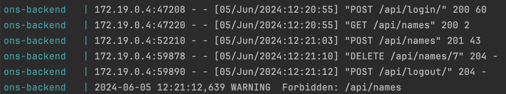

# ons
Online Name Server

## Softwarearchitektur

## Libraries

### Backend

@Joel

### Frontend

@Lars

## Logging

Django bietet bereits ein umfangreiches Logging, welches alle nützlichen Informationen liefert um Fehler zu debuggen. Das Logging kann jederzeit ergänzt werden.



## UI-Design

@Lars

## Einsatzfähigkeit

(Account Erstellung/Löschung, Login,/Logout, etc)

## Persistenz & Handhabung Credentials

@Noé

## Umsetzung & Handhabung Session

Die Session-ID wird in den Cookies abgespeichert.

### Login

Beim Login wird mit der Funktion `login` von Django eine Session-ID erstellt (`request.session.cycle_key()`), die anschliessend auf dem Client in den Cookies abgespeichert wird.

Ausschnitt aus `django.contrib.auth.login`:
```
def login(request, user, backend=None):
    """
    Persist a user id and a backend in the request. This way a user doesn't
    have to reauthenticate on every request. Note that data set during
    the anonymous session is retained when the user logs in.
    """
    [...]
    if SESSION_KEY in request.session:
        if _get_user_session_key(request) != user.pk or (
            session_auth_hash
            and not constant_time_compare(
                request.session.get(HASH_SESSION_KEY, ""), session_auth_hash
            )
        ):
            # To avoid reusing another user's session, create a new, empty
            # session if the existing session corresponds to a different
            # authenticated user.
            request.session.flush()
    else:
        request.session.cycle_key()
    [...]
    request.session[SESSION_KEY] = user._meta.pk.value_to_string(user)
    request.session[BACKEND_SESSION_KEY] = backend
    request.session[HASH_SESSION_KEY] = session_auth_hash
    if hasattr(request, "user"):
        request.user = user
    rotate_token(request)
    user_logged_in.send(sender=user.__class__, request=request, user=user)
```

### Logout

Beim Logout wird mit der Funktion `logout` von Django die Session zerstört (`flush`).

Funktion aus `django.contrib.auth.logout`:
```
def logout(request):
    """
    Remove the authenticated user's ID from the request and flush their session
    data.
    """
    # Dispatch the signal before the user is logged out so the receivers have a
    # chance to find out *who* logged out.
    user = getattr(request, "user", None)
    if not getattr(user, "is_authenticated", True):
        user = None
    user_logged_out.send(sender=user.__class__, request=request, user=user)
    request.session.flush()
    if hasattr(request, "user"):
        from django.contrib.auth.models import AnonymousUser

        request.user = AnonymousUser()
```

## Sicherheitsrelevante Aspekte/Vektoren

## Injektion

Beispiel @Lars

## Deployment

### Build Pipelines

Unser Frontend und Backend werden, sobald diese aktualisiert werden, automatisch als Docker Container verpackt und im Docker-Hub publiziert.
Sobald das neue Image im Docker-Hub publiziert wurde, löst die Build-Pipeline automatisch ein Redeployment auf dem Docker-Host aus.

### Docker-Deployment

Unser Projekt wird in 3 separaten Docker-Containern betrieben

- Frontend
- Backend
- Datenbank

Damit das Backend geschützt mit der Datenbank kommunizieren kann, werden diese Container mit einem Docker-Netzwerk verbunden.
Dadurch ist die Datenbank nicht öffentlich zugänglich und alle Zugriffe erfolgen durch das Backend (Stichwort Security).

### Reverse Proxy

Alle Zugriffe auf unsere Docker-Container laufen über einen Reverse-Proxy. Dadurch kann das Https-Handling ausserhalb der Container geschehen.
Auch können die diversen Vorteile wie Caching von Nginx genutzt werden.
Dieser Proxy leitet automatisch alle Aufrufe auf den Pfad ```/api/*``` an den Backend Container. Alle anderen Zugriffe werden an den Frontend-Container weitergeleitet.
